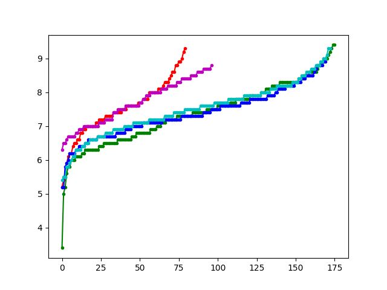

# UC-startrek-LP-spaces

Code about Star Trek rankings for a talk in the UCalgary undergrad seminar on Aug 3, 2018. The data was taken from [here](http://rikunert.com/star_trek_series) which ultimately came from the IMDB.

The code compute the (average) L1, L2, and L3 norms for 5 series of Star Trek. It also computes the L infinity norm. Here they are (scaled up to be between 10 to 99.)

	|L1|	L2|	L3|	L^infty
---|---|---|---|---
TOS|	74|	84|	40|	93
TNG|	73|	56|	23|	94
VOY|	73|	56|	24|	89
DS9|	74|	57|	24|	93
ENT|	76|	78|	36|	88

Here are the IMDB rankings of each episode, sorted, but not normalized.

